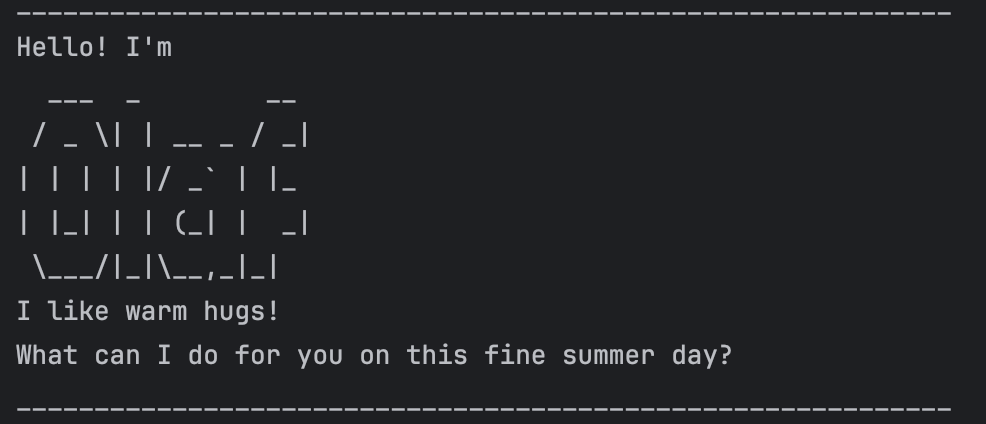

# Olaf User Guide

&nbsp;&nbsp;


Olaf is a desktop app for managing your tasks, optimized for use via a Command Line Interface (CLI).

---

## Table of Contents

* [Installation](#installation)

- [Quick Start](#quick-start)
* [Features](#features)
    * [Adding a todo: `todo`](#adding-a-todo--todo)
    * [Adding a deadline: `deadline`](#adding-a-deadline--deadline)
    * [Adding an event: `event`](#adding-an-event--event)
    * [Listing all tasks : `list`](#listing-all-tasks--list)
    * [Marking a task as done : `mark`](#marking-a-task-as-done--mark)
    * [Unmarking a task : `unmark`](#unmarking-a-task--unmark)
    * [Locating tasks by name: `find`](#locating-tasks-by-name--find)
    * [Deleting a task : `delete`](#deleting-a-task--delete)
    * [Exiting the program : `bye`](#exiting-the-program--bye)
* [Saving the data](#saving-the-data)
* [Command summary](#command-summary)

---

## Quick Start

Ensure you have **Java 17** or above installed in your Computer.

Download the latest `olaf.jar` from the releases page.

Copy the file to the folder you want to use as the home folder for your Olaf Task Manager.

Open a command terminal, `cd` into the folder you put the jar file in, and run the following command:

`java -jar olaf.jar`.

You should see a welcome message from Olaf. Type a command and press Enter to execute it.

---

### Adding a todo : `todo`

Adds a basic task that needs to be done, without any specific date or time attached to it.

**Format:** `todo DESCRIPTION`

**Examples:**
* `todo read book`
* `todo buy groceries for the week`

Output:
```
This just got a lot more complicated. I've added this to your list:
[T][ ] read book
Now you have 1 task in the list.
```

---

### Adding a deadline : `deadline`

Adds a task that needs to be done before a specific target date.

**Format:** `deadline DESCRIPTION /by DATE`

> **Important:** The `DATE` must be provided in the strict `yyyy-MM-dd` format (e.g., 2026-10-15).

**Examples:**
* `deadline read assignment /by 2026-03-08`
* `deadline return library books /by 2026-12-01`

Output:
```
This just got a lot more complicated. I've added this to your list:
[D][ ] read assignment (by: Mar 08 2026)
Now you have 2 tasks in the list.
```
---
### Adding an event : `event`

Adds a task that starts at a specific time and ends at a specific time.

**Format:** `event DESCRIPTION /from START /to END`

**Examples:**
* `event project meeting /from Mon 2pm /to 4pm`
* `event career fair /from 2026-08-10 /to 2026-08-12`

Output:
```
This just got a lot more complicated. I've added this to your list:
[E][ ] project meeting (from: Mon 2pm to: 4pm)
Now you have 3 tasks in the list.
```

---

### Listing all tasks : `list`

Shows a list of all tasks in the task manager, along with their index numbers and completion status.

**Format:** `list`

Output:
```
Here are the things you need to do:
1.[T][ ] read book
2.[D][ ] read assignment (by: Mar 08 2026)
3.[E][ ] project meeting (from: Mon 2pm to: 4pm)
```
---

### Marking a task as done : `mark`

Marks a specified task from the list as successfully completed.

**Format:** `mark INDEX`

* Marks the task at the specified `INDEX` as done.
* The index refers to the index number shown in the displayed task list.
* The index **must be a positive integer** 1, 2, 3, …

**Examples:**
* `mark 2` marks the 2nd task in the task manager as completed.

Output:
```
I mean I presume we’re done or is this “putting us in mortal danger” situation gonna be a regular thing
[D][X] read assignment (by: Mar 08 2026)
```
---
### Unmarking a task : `unmark`

Reverts a previously completed task back to an incomplete state.

**Format:** `unmark INDEX`

* Unmarks the task at the specified `INDEX`.
* The index refers to the index number shown in the displayed task list.
* The index **must be a positive integer** 1, 2, 3, …

**Examples:**
* `unmark 2` unmarks the 2nd task in the task manager.
  
Output:
```
Really? Wow, I can’t wait until I’ve aged just like you, so I don’t have to worry about important things.
We can do it later then.
[D][ ] read assignment (by: Mar 08 2026)
```
---
### Locating tasks by name : `find`

Finds all tasks whose descriptions contain the specified keyword.

**Format:** `find KEYWORD`

* The search is case-insensitive. e.g. `book` will match `Book`.
* The order of the tasks returned will match their original order in the full list.
* Only the description is searched (dates are not included in the search).

**Examples:**
* `find read` returns `todo read book` , `deadline read assignment /by 2026-03-08` and .

Output:
```
Here are the matching tasks in your list:
1.[T][ ] read book
2.[D][ ] read assignment (by: Mar 08 2026)
```
---
### Deleting a task : `delete`

Deletes the specified task from the task manager permanently.

**Format:** `delete INDEX`

* Deletes the task at the specified `INDEX`.
* The index refers to the index number shown in the displayed task list.
* The index **must be a positive integer** 1, 2, 3, …

**Examples:**

`delete 2` deletes the 2nd task in the task manager.

Output:
```
This just got a lot less complicated. I've deleted this task:
[D][ ] read assignment (by: Mar 08 2026)
Now you have 2 tasks in the list.
```
---
### Exiting the program : `bye`

Exits the program safely and prints a parting message.

**Format:** `bye`

Output:
```
I wish this could last forever, and yet change mocks us with her beauty.
Hands down, this is the best day of my life. And quite possibly the last.
Bye! (starts melting) Some people are worth melting for!
```
---
## Saving the data

Olaf Task Manager data is saved in the hard disk automatically after any command that changes the data (e.g., `todo`, `delete`, `mark`). There is no need to save manually.
The data is saved to `./data/olaf.txt`.

---
## Command summary

| Action | Format | Example |
| :--- | :--- | :--- |
| **Todo** | `todo DESCRIPTION` | `todo read book` |
| **Deadline** | `deadline DESCRIPTION /by DATE` | `deadline return book /by 2026-03-15` |
| **Event** | `event DESCRIPTION /from START /to END` | `event meeting /from 2pm /to 4pm` |
| **List** | `list` | `list` |
| **Mark** | `mark INDEX` | `mark 1` |
| **Unmark** | `unmark INDEX` | `unmark 1` |
| **Find** | `find KEYWORD` | `find book` |
| **Delete** | `delete INDEX` | `delete 3` |
| **Exit** | `bye` | `bye` |
---